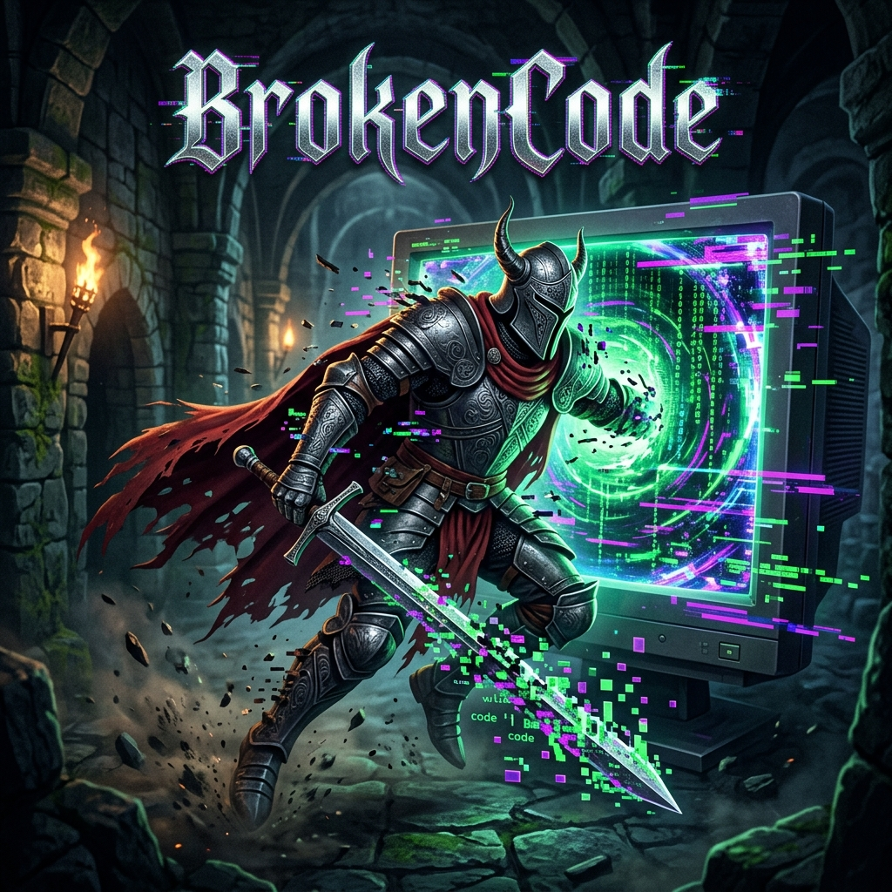

# 🗡️ BrokenCode

## 🎮 Press Play Hackathon 2026 — Team 17
**Constructor University Bremen | Google Developer Group (GDG) on Campus**

---

### 📖 The Idea: A Glitch in the Matrix (Medieval Edition)
The jam theme is **Medieval**, and we leaned into it twice. You play as a game developer who was building a medieval game for the jam, when their computer glitches and pulls them inside it. 

You are now trapped inside your own unfinished medieval worlds, forced to play through the buggy, incomplete games you never got to finish—from the inside. The medieval setting isn't just aesthetic; it's the reason you're stuck there in the first place.

### 🧠 Game Ideology & Logic
**BrokenCode** is a meta-narrative exploration of the chaotic, often fragmented journey of game development, manifested as a glitch-fuelled medieval adventure. The game places players in the shoes of a developer who is physically pulled into their own unfinished, bug-ridden creation, forcing them to navigate through the literal remnants of abandoned ideas and merged codebases. From the claustrophobic, top-down labyrinths of "The Maze" where traditional combat meets unstable enemy AI, to the vertical descent of "The Cellar" where survival depends on dodging bats and lethal flying eyes rather than combat, BrokenCode embraces its "broken" nature as its core philosophy. By intentionally integrating merging conflicts, invalid spawn points, and physics glitches into the gameplay experience, the project serves as both a challenging 2D action game and a tribute to the beautiful mess that is collaborative software creation, ultimately challenging players to find the "true ending" hidden within the digital debris of an incomplete world.

---

### 🕹️ Core Mechanics
The game is split into two distinct levels, each with completely different gameplay because they were originally two separate abandoned projects merged into one glitchy reality:

#### **Level 1 — The Maze**
*   **Genre:** Top-down Medieval Labyrinth
*   **Mission:** Navigate through corridors while avoiding goblins and skeleton enemies. Find the exit to escape and return to the real world.

#### **Level 2 — The Cellar**
*   **Genre:** Side-view Vertical Medieval Dungeon
*   **Mission:** Climb floors by navigating through doors. 
*   **⚠️ High Stakes:** Avoid the flying eyes—one touch from them means instant death. 
*   **The Twist:** You dont try to kill the enemy but you try to dodge the bats!

---

### ⌨️ Controls

#### **Level 1 — The Maze**
| Key | Action |
| :--- | :--- |
| **WASD / Arrows** | Move |
| **F Key** | Attack |
| **Space Bar** | Dash |
| **Any Key** | Skip Dialog |

#### **Level 2 — The Cellar**
| Key | Action |
| :--- | :--- |
| **WASD / Arrows** | Move |
| **F Key** | Attack |
| **Space Bar / Up Arrow** | Jump |
| **Any Key** | Skip Dialog |

---

### 🚧 Development Challenges & Difficulties
Creating a game in a 48-hour hackathon environment is a journey of its own:
*   **Merging Realities:** We worked on different Godot files and merging them together took the majority of our time. Dealing with version control in a fast-paced environment was a level of its own!
*   **Enemy Spawning Logic:** We encountered several bugs when spawning enemy characters around the map, sometimes resulting in enemies appearing in invalid tiles.
*   **Physics Glitches:** High-speed dashing sometimes causes the player to glitch, which actually fits our theme of being stuck in a "Broken" game.

---

### 🐞 Known Issues & Bugs
*   Enemies may spawn on invalid tiles in the maze.
*   Player may glitch when dashing at high speed.
*   Minor UI artifacts during scene transitions.

---

### 🛠️ Built With & Credits
Our world was built using a mix of original art, AI-assisted design, and incredible open-source assets from the game dev community:

*   **Engine:** [Godot Engine](https://godotengine.org/)
*   **Art Tools:** [Pixilart](https://www.pixilart.com/) (Original Pixel Art)
*   **Asset Attribution:**
    *   **Main Character (Lvl 1):** ["Hero Knight 2"](https://luizmelo.itch.io/hero-knight-2) by LuizMelo
    *   **Main Character (Lvl 2):** ["Warrior-Free Animation Set V1.3"](https://clembod.itch.io/warrior-free-animation-set) by Clembod
    *   **Enemy Characters:** ["Monsters Creatures Fantasy"](https://luizmelo.itch.io/monsters-creatures-fantasy) by LuizMelo
    *   **Level 1 Map & Environment:** ["Rogue Fantasy Catacombs"](https://szadiart.itch.io/rogue-fantasy-catacombs) by Szadiart
    *   **Level 1 Tileset:** Custom-built using Godot's internal tools and Szadiart's assets.
    *   **Level 2 Tileset:** Custom, generated with ChatGPT.
    *   **Cinematics:** Intro cutscene generated with Google Gemini.

---

### 🔗 Play Online
The game is available to play on itch.io:
[**Play BrokenCode on itch.io**](https://mickymouse67.itch.io/brokencode)

---

### 👥 Contributors (Team 17)
*   **Harishi Velavan**
*   **Aarya Chandrashekhar Chavan**
*   **Zeynep Yurtsever**
*   **Ashraya Banskota**
*   **Shaz Ansari**
*   **Nour Chatty**

*This project was created for the [Press Play Hackathon 2026](https://pressplay-cub.com/), organized by the Google Developer Group (GDG) on Campus at Constructor University Bremen.*

